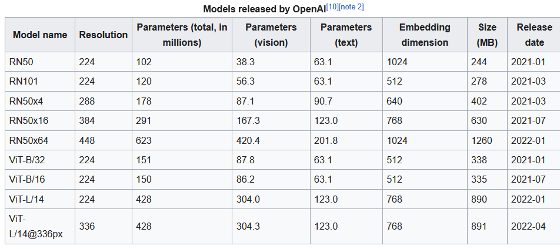

Alle möglichen vortrainierten Models (für Image Embeddings)

Stempelliste_bueschel_Neuses_einfach.xlsx unter main dir packen, neuen Ordner erstellen namens Images und dort alle
Coins (nur von einer Seite) einfügen und Script starten.